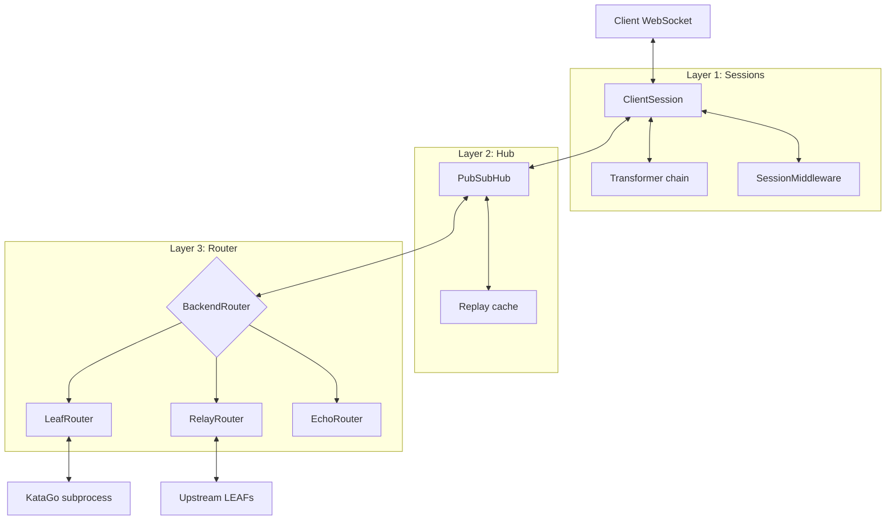

# Architecture

This document is for operators who want to extend KataProxy — to add custom
enrichment, change routing behaviour, support new protocols, or build a new
middleware. It assumes you have read the README and run a LEAF at least once.

The goal here is to give you a working mental model of how the code is
organised, where the extension points are, and which parts of the
architecture are solid foundations versus which parts are invitations for
improvement.

---

## The three-layer model

KataProxy is structured as three layers that communicate through narrow,
typed interfaces. Each layer is unaware of the layers above it.



**Layer 1 — Sessions** (`proxy_server.py`, `session_middleware.py`)
One `ClientSession` per connected WebSocket. Owns the per-client transformer
chain and the per-session middleware. Translates between the client's
external ID namespace and an internal namespace.

**Layer 2 — Hub** (`pubsub_hub.py`)
A single `PubSubHub` per server process. Coalesces semantically-identical
queries from different sessions into one backend query, then fans the
responses out to every subscriber. Owns the optional replay cache.

**Layer 3 — Router** (`router.py`)
A single `BackendRouter` per server process. Dispatches canonical queries
to the actual backend (KataGo subprocess, upstream WebSockets, or synthetic
echo). Tracks completion to signal the Hub when a query is fully done.

The key property of this decomposition: **each layer speaks a different ID
namespace**. A query crossing all three layers has its identity rewritten
twice. This is what lets the layers compose without leaking abstractions.

---

## ID namespaces and translation

A KataGo query carries an `"id"` field that the engine echoes back in every
response. KataProxy never lets an external `id` reach the engine, and never
lets an engine `id` reach a client. The translation chain looks like this:

```
client_id  --[ProxyLink in ClientSession]-->  internal_id
internal_id  --[PubSubHub coalescing]-->      canonical_id
canonical_id  --[BackendRouter dispatch]-->   wire_id (sent to engine)

wire_id (from engine)  --[BackendRouter]-->   canonical_id
canonical_id  --[Hub fans out, relabels]-->   internal_id (one per subscriber)
internal_id  --[ProxyLink reverse]-->         client_id
```

Why the indirection:

- **Client → internal**: prevents a malicious or buggy client from spoofing
  another client's IDs. Every session gets its own opaque internal namespace.
- **Internal → canonical**: lets the Hub coalesce identical queries from
  different sessions onto a single backend slot.
- **Canonical → wire**: lets the router rewrite IDs for backend-specific
  reasons (load tagging, fanout prefixes) without touching the upper layers.

The reverse path relabels each response once per subscriber. If three clients
have coalesced onto the same canonical query, each receives a copy of every
response with their own `internal_id` substituted in.

The contracts that hold these invariants together live in
`AbstractProxy/proxy_core.py`:

- `IdMapping` — bidirectional dict, thread-safe, pluggable ID generation
- `CompletionTracker` — knows when a multi-turn query has emitted all its
  expected final responses and the mapping can be torn down
- `ProxyLink` — one translation boundary; combines a mapping, a query
  policy, and a response policy
- `ProxyChain` — a sequence of links, folded one way for queries and the
  other way for responses

---

## Extension points

There are two extension surfaces, and the choice between them is
load-bearing. Pick wrong and your extension will be either much harder than
it needs to be or quietly broken.

### Transformers (synchronous, per-message)

A `Transformer` is a pair of pure functions: one that may modify outgoing
queries, one that may modify incoming responses. They are composed with
`.then()` and live in `protocol_transformer.py`.

Reach for a transformer when:

- You want to enrich every response with computed fields (e.g. add
  policy gradients derived from `moveInfos`)
- You want to inject default fields into queries that omit them
- You want to filter out responses matching some predicate
- The work is **stateless per message** and **synchronous**

Returning `None` from either function suppresses the message. The
suppression semantic is what makes filtering possible.

### Session middleware (asynchronous, stateful per session)

A `SessionMiddleware` intercepts the response stream as an async generator.
It can buffer, suppress, fan out, or inject new queries via the
`submit_query` callback.

Reach for middleware when:

- You need state across messages (counters, sliding windows, decisions
  based on history)
- You want to issue follow-up queries based on response content
- The work is **async** (e.g. needs to await something)
- You need to control **when** responses are emitted, not just **what** they
  contain

The defining example is `adaptive_reevaluate`: it watches scores across
turns, identifies the worst-performing positions in a window, and submits
follow-up queries with higher visit counts. This requires history, async
submission, and control over response timing — all three.

---

## Recipe: add a query enricher transformer

Implement `Transformer` with a no-op `on_response` and a query rewrite in
`on_query`. Wire it into `proxy_server.py`'s `transformer_factory` argument
to `ProxyServer(...)`. The composition order with `.then()` determines
which transformer runs first; downstream and upstream traverse the chain
in opposite directions.

## Recipe: write a session middleware that buffers responses

Subclass `SessionMiddleware` and implement `handle_response` as an async
generator. To buffer, accumulate responses in instance state and yield
nothing; to release, yield all accumulated entries when your release
condition fires. Wire via the `middleware_factory` argument to
`ProxyServer(...)` — note that the factory is called once per session,
because middleware is stateful and must not be shared.

## Recipe: plug in a custom load metric

Subclass `LoadMetric` (`router.py`) and implement the three required
methods: `on_query_sent`, `on_query_complete`, `current_load`. Pass an
instance to `make_router(...)` via the `load_metric` parameter. The default
is `InFlightQueryLoad`, which counts outstanding queries per upstream;
alternatives could measure byte throughput, latency-weighted scores, or
GPU memory pressure reported by the upstream.

---

## Where this falls short

KataProxy is the work of one person who is not a professional computer
scientist, and the architecture reflects that. The high-level layer
decomposition is, the author believes, sound. Several lower-level
abstractions are not. They work, they are tested in practice, but they
would benefit from review by someone with formal training in the relevant
areas. Pull requests welcome.

### The `Prism` abstraction is approximate

`AbstractProxy/proxy_core.py` defines a `Prism` type modelled loosely on
the optics paradigm from functional programming (Haskell's `lens` library,
Scala's Monocle). A real Prism is a pair of functions with specific
algebraic laws: `preview . review = Just` and `review . preview = id` for
matched cases. The implementation here is *shaped* like a Prism — a
`preview` that may fail and a `review` that reconstructs — but it does not
prove or even attempt to enforce the laws.

If you have a background in functional programming or category theory, the
codebase would benefit from a rigorous treatment. The current Prisms work
because they are used in narrow, controlled ways; they would not survive
contact with a more demanding caller.

### The `Dispatcher` is unused in the live code path

`Dispatcher` is meant to be the runtime that consults a sequence of Prisms
and dispatches to the first one that matches. In the actual codebase, the
KataGo query parser does not use it — it uses direct dict-key inspection.
The Dispatcher exists as scaffolding for a future world where multiple
protocols (or protocol versions) are supported simultaneously. It is
neither tested nor exercised; treat it with appropriate suspicion.

### Protocol abstraction leaks at the edges

The intent of `AbstractProxy/proxy_core.py` is to be protocol-agnostic, with
all KataGo specifics confined to `katago_proxy.py`. The intent is mostly
realised, but several places have KataGo assumptions baked into supposedly
generic code (the `str` constraint on identity types, the assumption that
turn numbers are integers). A second protocol implementation would surface
these leaks quickly and is the test the abstraction has not yet had to pass.

### The `rxp` reactive pipeline is experimental

The `rxp/` subpackage was a reactive-pipeline experiment that is currently
used only by `bsa.py`. It is not integrated with
the main message flow. If you find it useful, it is yours; if you do not,
ignore it — the core proxy does not depend on it.

---

## Module map

For an extender looking for the right file to read:

| File | Layer | What lives here |
|---|---|---|
| `proxy_server.py` | 1 | `ProxyServer`, `ClientSession`, `RedirectSession`, `_main` |
| `session_middleware.py` | 1 | `SessionMiddleware` ABC, `MiddlewareChain`, `IdentityMiddleware` |
| `AbstractProxy/protocol_transformer.py` | 1 | `Transformer`, `TransformedChain` |
| `AbstractProxy/katago_transformers.py` | 1 | KataGo-specific transformers |
| `pubsub_hub.py` | 2 | `PubSubHub`, `CoalescingPolicy`, `CacheStore` protocol |
| `router.py` | 3 | `BackendRouter` ABC, `LeafRouter`, `RelayRouter`, `EchoRouter`, `LoadMetric`, `HashRing` |
| `AbstractProxy/proxy_core.py` | All | `IdMapping`, `CompletionTracker`, `ProxyLink`, `ProxyChain`, `Prism`, `Dispatcher` |
| `AbstractProxy/katago_proxy.py` | All | KataGo protocol types, prisms, parsers |
| `sproxy_config.py` | All | Environment-driven configuration |
| `logging_config.py` | All | Optional `ColoredLogger` shim |
| `flt.py` | All | Utility: filter-recursive-dict for log readability |
