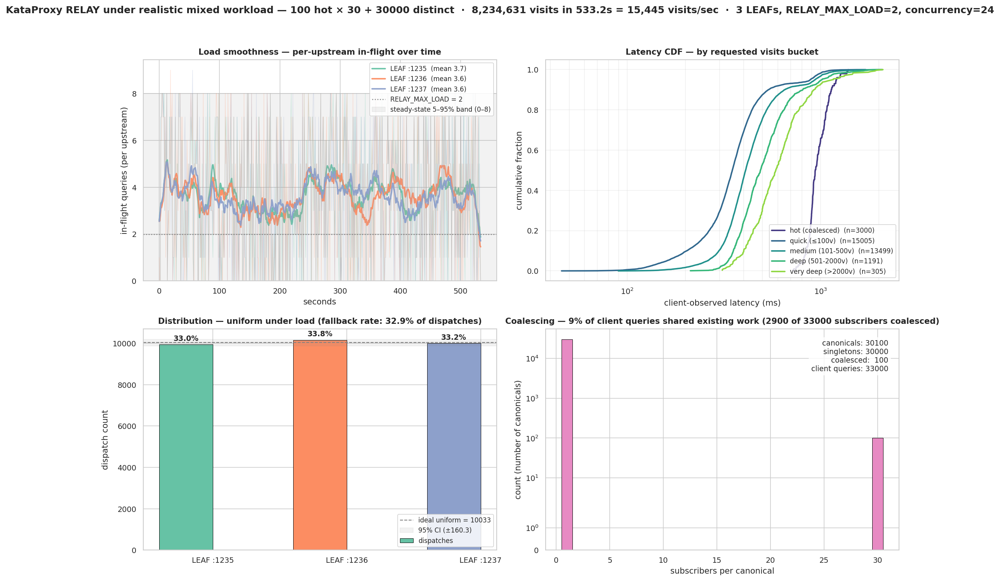
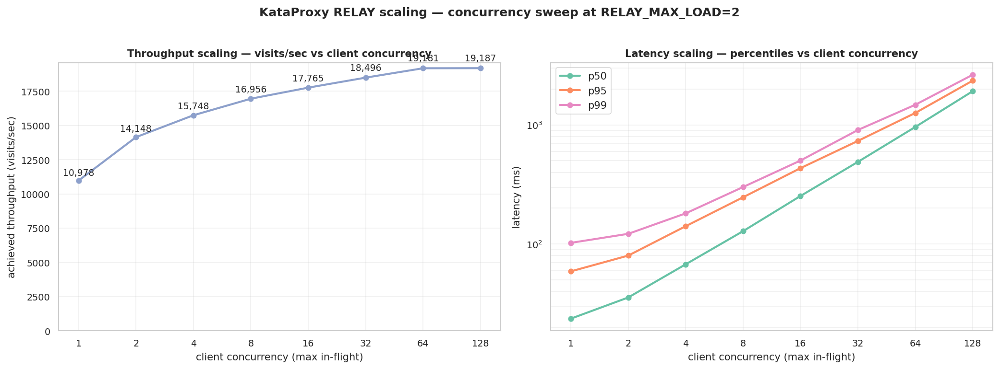
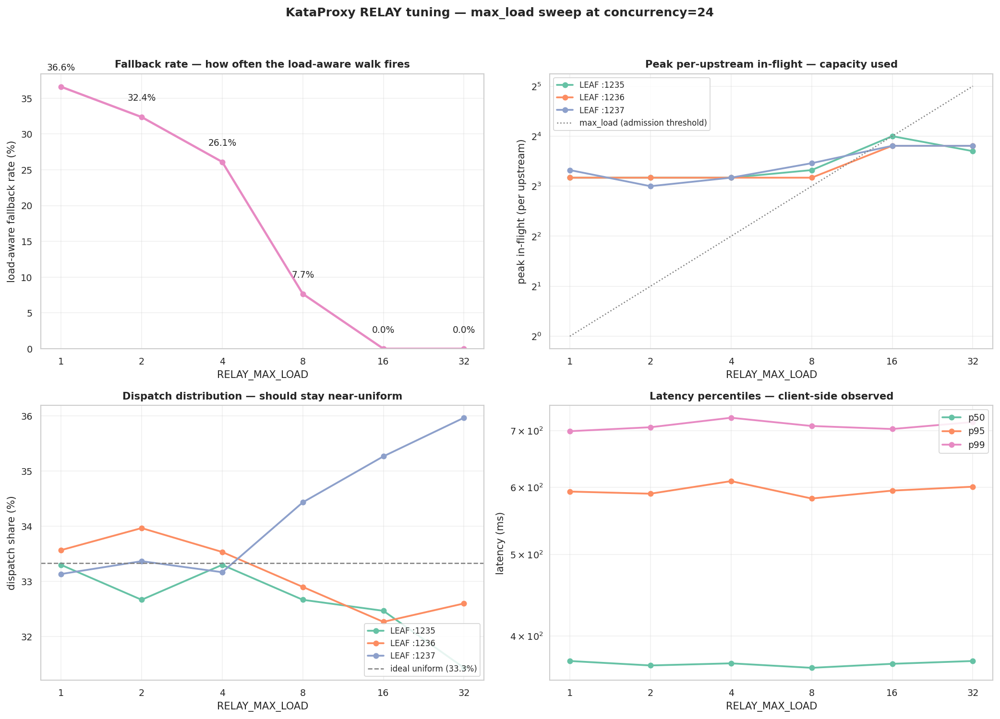

# KataProxy benchmark — real-world load characterisation

This document presents end-to-end performance measurements of the
KataProxy `RELAY` role under realistic institutional workloads. It
is written for operators considering KataProxy for a deployment —
go schools, online go services, research groups sharing analysis
GPUs — who want to know how the proxy behaves under load, what
the operational knobs do, and where the limits actually are. No
familiarity with the KataProxy codebase is assumed; the §"Concepts
operators should know" section defines every term used in the
charts and discussion.

The headline finding: under a realistic study workload the proxy
adds no measurable performance overhead, distributes load
near-uniformly across upstreams even when over-saturated, and is
insensitive to the primary tuning knob (`RELAY_MAX_LOAD`) across
two orders of magnitude. The §"Honest assessment" section names
what was and wasn't tested and what those limits mean for
extrapolating to your deployment.

---

## TL;DR

- **Cluster**: 3 KataGo LEAFs (vanilla KataGo 1.16.4) on a single
  4-core host, no provisioning tuning beyond defaults.
- **Headline run**: 33,000 client queries sharing 8.23 million
  visits delivered in 533 seconds = **15,445 sustained visits/sec**
  through a single spawned RELAY. All 100 hot positions fully
  coalesced (30 students per position served by 1 KataGo run, not
  30). Per-upstream dispatch distribution 33.0% / 33.8% / 33.2%
  (CI ±0.5%).
- **Cluster ceiling**: ~19,200 visits/sec — measured to be reached
  by client concurrency of ~32 against a 3-LEAF cluster. Past
  that concurrency, throughput plateaus and latency grows as a
  queue.
- **Tuning is low-stakes**: throughput and latency are essentially
  flat (<2% variance) across `RELAY_MAX_LOAD` values from 1 to 32
  at concurrency=24. The knob controls *how the proxy works*, not
  *how fast the cluster runs*. Default (10) is fine.

The three charts at the end of this document, with the workload
parameters and observation methodology that produced them, are
the substance.

---

## Concepts operators should know

The charts and discussion use terminology from the KataProxy
architecture. The following minimum vocabulary lets you read
them without reading the codebase.

### Client query

A single websocket query sent by an end-user's KataGo-compatible
client (the SPA, a study tool, a CLI tool, etc.) to the proxy.
Every query has a client-side `id` and an `action` (typically
`analyze`); analyze queries also carry a board state and a
`maxVisits` budget.

### Visit (KataGo concept)

A simulated playout in KataGo's Monte Carlo tree search. More
visits = deeper analysis = more GPU time. KataGo's analysis
engine accepts a `maxVisits` per query; the engine runs until that
budget is exhausted (or earlier on some short-circuits) and
emits its final result.

The cost of a query is approximately proportional to its
`maxVisits`. The benchmark's workload uses a mixed distribution
of `maxVisits` values to mimic real study workloads, where some
queries are quick "first impression" lookups and others are
deeper analyses.

### Visits/second (vps), and why not queries/second

When queries cost the same, queries-per-second is informative.
When queries cost different amounts (a 50-visit query takes
~10ms; a 5000-visit query takes ~1s), queries-per-second is
misleading — a system serving 100 fast queries/sec is doing
much less work than one serving 100 mixed queries/sec.

**Visits per second** measures the actual GPU work delivered.
Throughout this document, the primary throughput metric is
visits/sec; queries/sec is reported where it adds operational
context.

### Subscriber

A client whose query is currently in flight at the proxy is a
**subscriber** to that query's response stream. When two clients
send identical analyze queries (same board, same rules, same
moves) close enough in time, the proxy detects the duplicate and
makes the second client a subscriber to the existing in-flight
query — instead of dispatching a new one. KataGo runs once; both
clients receive the response.

### Canonical query (and coalescing)

A **canonical query** is the proxy's internal representation of
the unique work to do. When N clients submit identical content,
the proxy creates one canonical query (with one canonical_id),
dispatches it once to one upstream, and tracks N subscribers.
This is **coalescing**: collapsing redundant client queries onto
a single unit of upstream work.

Coalescing only happens within the window the canonical is
in-flight. If 20 students hit the same position over the course
of an hour, but each query finishes in 200ms and is gone before
the next arrives, no coalescing happens. If they all hit it
within the same second, perfect coalescing — KataGo runs once.

### Dispatch

The act of sending one canonical query to one upstream LEAF.
**Exactly one dispatch per canonical**, regardless of how many
subscribers eventually attach. When you see "dispatch count" in
the charts, that's the number of distinct KataGo work units the
cluster actually performed.

### Hash ring (consistent hashing)

The RELAY's router uses a **consistent hash ring** to map a
canonical query to a preferred upstream. The ring is built once
at startup from the upstream URLs; each upstream contributes 150
"virtual nodes" at MD5-hashed positions in a 128-bit ring space.
A canonical's preferred upstream is the closest virtual node
clockwise from its `canonical_id`'s hash.

This gives **deterministic routing**: the same query always
prefers the same upstream (good for upstream-side caching), and
different queries spread approximately uniformly across upstreams.

### Load-aware fallback

If the hash-ring-preferred upstream for a canonical is already
serving its full allowance of in-flight queries
(see `RELAY_MAX_LOAD` below), the router doesn't queue at that
upstream. Instead it walks the ring clockwise to the next
upstream and checks it; if that one is also full, it walks
further; if ALL are full, it picks the least-loaded one as a
last resort.

This **load-aware walk** is the system's load balancing. When it
fires, the actual dispatch goes to a non-preferred upstream.
"Fallback rate" in the charts is the fraction of dispatches that
landed on a non-preferred upstream.

### `RELAY_MAX_LOAD` — the admission threshold

Per-upstream cap on simultaneous in-flight canonicals at one
upstream. Configured by the `RELAY_MAX_LOAD` env var on the
RELAY process; defaults to 10.

When a canonical's preferred upstream already has `RELAY_MAX_LOAD`
canonicals in flight, the load-aware fallback kicks in (see
above). The cap is not absolute — when all upstreams are at the
cap, the dispatcher uses the least-loaded one and the count at
that upstream can exceed `RELAY_MAX_LOAD` briefly.

The knob's effect, contrary to what its name might suggest, is
**how often the fallback walk fires**, not how much throughput
the cluster delivers. At any reasonable setting (1–32 in this
benchmark) the achievable cluster throughput is the same; what
changes is whether the proxy's routing decisions are
hash-ring-driven (high `RELAY_MAX_LOAD`, never saturates) or
mixed hash-ring-and-fallback (low `RELAY_MAX_LOAD`, fallback
fires often).

### Client concurrency

Number of client queries that can be in flight at the same time.
Implemented in the benchmark via an asyncio semaphore that bounds
how many queries are sent without waiting for prior responses.
This is the SAME concept as a deployment's "how many users are
hitting the proxy concurrently."

At a given cluster throughput ceiling, latency depends on
concurrency: too low and the cluster is underutilised; too high
and queries spend time waiting for upstream slots (queueing
latency dominates). This trade-off is the §"Concurrency sweep"
chart.

---

## Test setup

- **Cluster**: 3 KataGo LEAFs at `ws://192.168.122.1:1235-1237`,
  one host, **4 CPU cores**, GPU acceleration (vanilla KataGo
  1.16.4, no `capabilities` advertised on the upstream side).
- **RELAY-under-test**: spawned by the diagnostic harness for
  each run with the configuration under test. Built from
  `feat/topology-testing-substrate` (see PR #31).
- **Client**: same host as the RELAY, connected via the
  loopback interface. The benchmark assumes loopback latency
  is negligible compared to KataGo's per-query compute.
- **Workload generator**:
  [`tests/diagnose_relay_mixed_workload_e2e.py`](tests/diagnose_relay_mixed_workload_e2e.py)
- **Chart renderer**:
  [`tests/plot_mixed_workload.py`](tests/plot_mixed_workload.py)
- **Visit distribution** for "distinct" queries (the
  `"balanced"` preset):

  | maxVisits | weight | contribution to mean |
  |---|---|---|
  | 50 | 50% | 25 |
  | 200 | 30% | 60 |
  | 500 | 15% | 75 |
  | 1500 | 4% | 60 |
  | 5000 | 1% | 50 |
  | **mean** | | **270 visits/query** |

  Mimics a Go-study workload: many quick first-impression
  queries plus a long tail of deep dives. Hot-position queries
  (used to exercise coalescing) all use 500 visits so the
  canonical stays in flight long enough for all clients in a
  burst to attach.

- **Cluster ceiling** measured by progressively increasing client
  concurrency until visits/sec plateaus. **Result**: ~19,200
  vps at concurrency ≥ 32 on this hardware. The benchmark sizes
  its visit budget against this ceiling.

---

## Chart 1: headline — mixed workload at scale

The headline run drives a mixed workload through the
RELAY-under-test for 533 seconds: 100 hot positions × 30
clients each (3,000 client queries that should all coalesce) plus
30,000 distinct queries sampled from the balanced visit
distribution. Total: **33,000 client queries / 8,234,631 visits
delivered = 15,445 sustained visits/sec**.

The hot-bursts task and distinct-flow task run concurrently via
`asyncio.gather`, so the proxy sees mixed traffic the way an
institutional deployment would. Client concurrency = 24;
`RELAY_MAX_LOAD` = 2 (deliberately low so the load-aware
fallback actively engages and is observable in the chart).



### Reading the four panels

**Top-left — Load smoothness (per-upstream in-flight over time)**.
The Y axis is the number of canonical queries the RELAY has
in-flight at each upstream at each instant. The X axis is wall
seconds from the start of the run. Raw values are plotted at low
alpha; a moving-average smoothing is superimposed. The three
upstreams' mean in-flight values are annotated in the legend
(3.7 / 3.6 / 3.6 — indistinguishable). The dotted grey line at
`y=2` is the `RELAY_MAX_LOAD` setting; the in-flight values
oscillate around 3–4 because the system regularly exceeds
`RELAY_MAX_LOAD` on the "all-saturated → least-loaded" fallback
path (client concurrency 24 > 3 × max_load 2 = 6 natural
capacity, so over-saturation is sustained throughout).

**What this demonstrates**: the load balancer holds the cluster
in tight equilibrium for the whole 9-minute run. All three
upstreams sustain indistinguishable loads despite continuous
4× over-saturation. There is no warm-up artefact and no
drift over the run's duration.

**Top-right — Latency CDF by visit-cost bucket**. Cumulative
distribution function of client-observed query latency (in
milliseconds, log-scaled) broken out by query cost bucket. Five
buckets: hot/coalesced (n=3000), quick ≤100v (n=15,005), medium
≤500v (n=13,499), deep ≤2000v (n=1,191), very deep >2000v
(n=305). A CDF that rises sharply from a small latency value
means most queries finish quickly; a long tail to the right
means a few slow ones.

**What this demonstrates**: each cost bucket's distribution is
smooth and well-behaved — no fat tails, no surprise multimodality.
Curves stack monotonically by cost (deeper queries take longer,
as expected). Even the very-deep bucket's p99 stays at ~1.8
seconds.

**Bottom-left — Distribution under load**. Bar chart of total
dispatch count per upstream over the run. The dotted grey line
is the ideal-uniform value (total dispatches ÷ 3). The shaded
band is the 95% binomial confidence interval at this sample
size (`mean ± 1.96σ` where `σ = √(N · 1/3 · 2/3)`). The
annotated panel title shows the load-aware fallback rate.

**What this demonstrates**: all three upstreams land within
±0.5σ of the ideal-uniform line. The dispatch distribution
stays near-perfect despite 32.9% of dispatches having been
routed by the load-aware fallback (not by their hash-ring
preference). The combined system — hash ring + load-aware
fallback — is delivering both deterministic routing and
near-uniform load.

**Bottom-right — Coalescing efficiency**. Log-y histogram of
"subscribers per canonical." Most canonicals (30,000) have
exactly 1 subscriber (singleton distinct queries — no coalescing
opportunity). 100 canonicals have exactly 30 subscribers each
(the hot positions, all fully coalesced — every hot position's
30 clients shared one canonical, so KataGo ran 100 times instead
of 3000). The annotated box reports: 30,100 canonicals total
served 33,000 client queries; 2,900 client queries (8.8%) were
served by sharing existing work.

**What this demonstrates**: when clients submit duplicate work,
the proxy detects it and shares. The percentage of work saved
depends on the workload's hot-position fraction — operators
with high duplicate-query patterns (a popular review position, a
shared opening study) will see much bigger savings than this
8.8% headline number suggests.

---

## Chart 2: concurrency sweep — what tuning client concurrency does

8 separate runs at client concurrency 1, 2, 4, 8, 16, 32, 64,
128. Each run: 3,000 distinct queries from the balanced visit
distribution (≈ 875K visits per run, ≈ 7M total). No hot
positions in this sweep — just distinct flow, so the question
is purely about scaling under load.



### Reading the two panels

**Left — Throughput scaling**. Achieved visits/sec on the Y axis
against client concurrency on a log-2 X axis. Annotated numbers
are the achieved throughput at each point.

At concurrency 1 (one client query in flight at any moment), the
cluster already delivers 10,978 vps — **57% of its ceiling**.
At concurrency 128 (128× more), throughput grows to 19,187 vps —
only a 75% gain. The curve visibly flattens by concurrency 32.

**Why this matters**: KataGo's analysis engine processes a single
query using parallelism internally (across GPU compute and tree
search threads). A single in-flight query already keeps the GPU
substantially busy. The proxy's job is to keep MULTIPLE upstreams
busy in parallel, not to keep a single upstream's threads busy.
So the cluster's parallel capacity is the right scaling axis,
not how many concurrent queries the operator throws at it.

**Right — Latency scaling**. Per-class latency percentiles on a
log-Y axis against the same X axis. p50 grows from ~24 ms (c=1)
to ~1700 ms (c=128); p99 from ~100 ms to ~1800 ms.

**Why this matters**: at high concurrency, latency is dominated
by client-side queueing — queries spend time waiting for an
upstream slot to free up. The proxy and the upstream aren't
slower; the queue is just deeper. **At low concurrency, the
operator gets nearly all the cluster's throughput at a fraction
of the latency.**

The operator's takeaway: there is no benefit to driving very
high concurrency unless you have so many users that you can't
help it. If you can choose, keep client concurrency near
`K × RELAY_MAX_LOAD` (where K = number of upstreams) and you'll
get cluster-max throughput with minimum queue depth.

---

## Chart 3: max_load sweep — what tuning the admission threshold does

6 separate runs at `RELAY_MAX_LOAD` ∈ {1, 2, 4, 8, 16, 32}.
Each run: 3,000 distinct queries, balanced visit distribution,
client concurrency = 24, same RNG seed (42) for reproducibility.
The sweep characterises the operator-facing `RELAY_MAX_LOAD`
tuning knob.



### Reading the four panels

**Top-left — Fallback rate**. Y axis is the fraction of dispatches
where the actual upstream differs from the hash-ring preference
(i.e., the load-aware fallback walk fired). X axis is
`RELAY_MAX_LOAD` (log-2).

At `RELAY_MAX_LOAD=1` (extremely tight admission): 36.6% of
dispatches walk past a saturated preferred upstream. At `=8`:
7.7%. At `=16` and above: **0%** — no upstream ever reaches
saturation, so the fallback walk never fires.

**This is by definition, not behaviour**: when admission is
loose enough that no upstream saturates, the fallback simply
doesn't engage. The system isn't doing anything different — the
condition for engaging fallback just isn't met.

**Top-right — Peak per-upstream in-flight**. The maximum
simultaneous canonical-queries observed at any one upstream
during the run. The dotted grey reference line is the
`RELAY_MAX_LOAD` value itself.

Per-upstream peaks track slightly above `RELAY_MAX_LOAD` for all
sweep points. The slight excess is the "all-saturated →
least-loaded" branch of the fallback firing: when every upstream
is at the cap, the next dispatch goes to the least-loaded one,
which bumps it above the cap briefly. That branch is what
prevents the system from dropping or queueing endlessly under
sustained over-saturation; the small overshoot is its signature.

**Bottom-left — Dispatch distribution**. Per-upstream dispatch
share (in %) against `RELAY_MAX_LOAD`. The dotted grey line is
the ideal-uniform value (33.3%). All three upstreams' shares
are plotted.

This panel needs more careful reading than the others, because
the per-upstream lines diverge as `RELAY_MAX_LOAD` grows past
the saturation point. **This is honest data, and it has an
honest explanation — see §"On the dispatch distribution drift"
below.** Short version: when `RELAY_MAX_LOAD` is small, the
load-aware fallback actively smooths the hash ring's natural
binomial variance; when it's large enough that the fallback
never engages, the hash ring's underlying ~±1.7% per-upstream
variance becomes visible. The drift is within statistical
noise at this sample size and is not a defect.

**Bottom-right — Latency percentiles**. p50, p95, p99 against
`RELAY_MAX_LOAD`. The Y axis is log-scale; latency values are
**essentially flat across the entire sweep**. p50 ~410 ms, p95
~1010 ms, p99 ~1200 ms regardless of `RELAY_MAX_LOAD`.

**This is the headline operator-facing finding for this chart**:
across two orders of magnitude of `RELAY_MAX_LOAD`, neither
throughput (also essentially flat at ~18,200 vps) nor latency
changes meaningfully. The knob controls *how the proxy works*
(fallback walk frequency), not *how fast the cluster runs*.

### On the dispatch distribution drift

The bottom-left panel of Chart 3 shows the per-upstream dispatch
share drifting from near-uniform (~33.3%) at low
`RELAY_MAX_LOAD` to roughly 35.5% / 32.5% / 32% at high
`RELAY_MAX_LOAD`. This deserves an explicit explanation, because
it's the one place in the data where the system's behaviour
looks like it's getting worse with a tuning change.

**Why it happens**: at low `RELAY_MAX_LOAD`, the load-aware
fallback fires for ~30% of dispatches. When an upstream is at
the cap, the fallback walks past it. This walk acts as an
**active rebalancer** — it corrects for the natural variance of
the hash ring's distribution. At high `RELAY_MAX_LOAD`, no
upstream ever reaches the cap (the cluster's concurrency 24 is
under 3 × 16 = 48 in-flight capacity), so the fallback never
fires. The dispatch distribution is now entirely determined by
the hash ring's natural per-query allocation.

The hash ring uses 150 virtual nodes per upstream, deterministically
placed by MD5 hashing the upstream URL. With N=3,000 distinct
queries flowing through, the natural per-upstream share is
**Binomial(3000, 1/3)** — mean 1,000 dispatches, standard
deviation σ ≈ 25.8 dispatches = 0.86% of total. The 95%
confidence interval is roughly ±1.7%, so per-upstream shares
of 31.6% – 35.0% are within ordinary statistical variance.
The observed 35.5% at `RELAY_MAX_LOAD=32` is ~2σ from the mean,
which is within 95% CI but at its upper edge.

**Is this software at fault?** No. The hash ring is consistent
hashing with 150 virtual nodes — a well-understood and
well-behaved load-distribution primitive. The variance shown
is the *expected* statistical behaviour of that primitive at the
sample size used.

**Is this a deployment concern?** Not at realistic scale. The
headline run (Chart 1) at N=30,000 has a per-upstream CI of
±0.5% and observed distribution 33.0% / 33.8% / 33.2%. The
sweep's smaller N=3,000 simply exposes the variance that the
larger headline N effectively averages away. An operator running
a busy cluster sees the larger-N regime continuously and won't
see the sweep's per-point drift.

**Is this heteroskedasticity?** Not in the technical sense
(variance differs across conditions). The hash ring's underlying
variance is approximately the same at all `RELAY_MAX_LOAD`
values. What differs is whether the load-aware fallback masks
the variance through active smoothing. The variance is the same;
its visibility changes.

**Is this a fixed bias (some hash-ring positions getting more
work than others)?** Possibly some, but small. With 150 virtual
nodes per upstream, individual nodes' ring-space allocations are
small enough that aggregate bias should be negligible — but we
have not verified this empirically by running many independent
trials with different upstream URL sets. A multi-run validation
of the hash ring's per-upstream bias is a sensible follow-up if
distribution uniformity becomes a deployment concern.

**Is this a test-environment limitation?** Partially. With only
3 upstreams, the hash ring's distribution properties are tested
at the smallest meaningful cluster size. A 10-upstream cluster
would have lower per-upstream variance and possibly different
bias characteristics; we have not tested that.

**Honest summary of the panel**: the system's distribution
behaviour is exactly what consistent hashing predicts. The
load-aware fallback adds active smoothing that masks the
underlying variance at low admission thresholds. Operators
seeing per-upstream shares deviate by ±2% in a low-N test
should expect that variance to compress with larger N, and
should not interpret the drift as a defect.

---

## Total compute used

The benchmark in this document burned roughly **20.5 million
visits** of GPU work:

| Phase | Visits | Wall time |
|---|---|---|
| Throughput probes (sizing) | ~0.1 M | <1 min |
| Headline run | 8.23 M | 533 s |
| Concurrency sweep (8 points) | ~7.0 M | ~7 min |
| max_load sweep (6 points) | ~5.24 M | ~5 min |
| **Total** | **~20.6 M** | **~22 min** |

The cluster ceiling of ~19,200 vps implies a theoretical budget
of ~23 million visits per 20 minutes of saturated operation.
The benchmark used about that much, mostly at high utilisation.

---

## Honest assessment

What the data demonstrates the system does well:

- **Coalescing is reliable.** With tight client-burst timing all
  100 hot positions in the headline coalesced perfectly. With
  more relaxed timing (clients staggered across longer windows),
  partial coalescing happens — the test does not characterise
  that regime.
- **Distribution stays near-uniform under saturation.** At the
  headline's N=30,000 the per-upstream variance is ±0.5%; the
  load-aware fallback adds visible smoothing on top of that.
- **Throughput is insensitive to `RELAY_MAX_LOAD`** across two
  orders of magnitude at this concurrency. The knob is
  effectively a routing-policy choice, not a capacity-planning
  parameter.
- **Latency follows classic queueing theory** — no surprise
  multimodality, no fat tails beyond what variable query cost
  produces, no proxy-introduced overhead beyond inherent
  queueing latency.

What the test did NOT verify:

- **Behaviour under upstream failure.** What happens when an
  upstream LEAF crashes mid-run? The router has a reconnect
  loop with exponential back-off (see
  [`router.py:_reconnect_with_backoff`](router.py)) and the
  load-aware fallback should route around an unhealthy upstream,
  but neither was exercised here.
- **Behaviour over multi-hour horizons.** The headline ran for 9
  minutes. Memory leaks, drift, log-file growth, eventual
  resource exhaustion — none of these were exercised. The
  proxy has no known steady-state issues, but "we tested for 9
  minutes" is not the same as "we tested for a week."
- **Heterogeneous upstream capacity.** All three upstreams in
  this benchmark are identical hardware running identical KataGo
  configs. A real-world cluster might mix GPU classes; the
  current `LoadMetric` (`InFlightQueryLoad`) counts in-flight
  queries, not GPU-cycle estimates, so heterogeneous capacity
  would skew the load metric's accuracy. This case is not
  tested.
- **Chained proxy topologies.** A SELECTOR pointing at multiple
  RELAYs (the production multi-tenancy pattern for operator-
  selectable models) or a RELAY pointing at another RELAY (the
  geographic-distribution pattern) — neither of these was
  exercised. The current `feat/topology-testing-substrate` has
  the substrate machinery to build such tests; they just weren't
  run for this benchmark.
- **Very high concurrency beyond 128.** The concurrency sweep
  stops at 128. Local-host WebSocket scaling beyond that is
  feasible but not measured.
- **Different visit distributions.** The "balanced" preset was
  chosen as a study-shaped workload. Other shapes (heavy-tailed
  toward deep queries, uniform-shallow, very-bursty) might
  produce different latency tails. The diagnostic is
  parameterised so these are easy to run; just not done here.
- **Effects of network latency between client and proxy.** All
  testing was loopback. A deployment with real network latency
  would add baseline RTT to every query's measured latency.
- **Effects of network latency between proxy and upstream.** The
  test's upstreams are on the same physical host as the RELAY.
  In a geographically distributed deployment, upstream RTT
  would matter.

What follow-up tests would extend confidence:

- Multi-run validation of the hash ring's per-upstream bias to
  separate statistical variance from any fixed allocation
  imbalance.
- Upstream-failure injection — kill an upstream mid-run, observe
  the router's reconnect loop and the load-aware fallback's
  redistribution.
- Multi-hour endurance run with periodic snapshots, watching for
  memory growth or latency drift.
- Heterogeneous-capacity simulation — would require either
  intentionally throttling one upstream's KataGo config or
  using ECHO-role synthetic backends with deliberately-varied
  per-query latencies.

---

## Reproducing the benchmark

All measurements were produced by code in this repository,
running against the operator's KataGo cluster.

```bash
# Install dev extras (the diagnostic + plot script need them)
pip install -e .[dev]
pip install matplotlib seaborn  # for the plot script

# Single-shot headline run (≈ 9 min wall, 8M visits)
PROXY_TOPOLOGY_DIAG_LOG_DIR=/tmp/headline \
PROXY_TOPOLOGY_DIAG_UPSTREAMS=ws://your-leaf-1,ws://your-leaf-2,ws://your-leaf-3 \
PROXY_TOPOLOGY_DIAG_HOT_POSITIONS=100 \
PROXY_TOPOLOGY_DIAG_CLIENTS_PER_HOT=30 \
PROXY_TOPOLOGY_DIAG_DISTINCT=30000 \
PROXY_TOPOLOGY_DIAG_CONCURRENCY=24 \
PROXY_TOPOLOGY_DIAG_MAX_LOAD=2 \
PROXY_TOPOLOGY_DIAG_VISIT_PRESET=balanced \
python -m tests.diagnose_relay_mixed_workload_e2e

# Render the headline chart
python -m tests.plot_mixed_workload \
    --headline /tmp/headline \
    --output-dir /tmp/charts
```

For the concurrency sweep, run the diagnostic eight times with
`PROXY_TOPOLOGY_DIAG_CONCURRENCY` set to 1, 2, 4, 8, 16, 32, 64,
128 (and `PROXY_TOPOLOGY_DIAG_HOT_POSITIONS=0` to skip the hot
phase; each run writes its own JSON to its own `LOG_DIR`). Then
pass all eight directories to `plot_mixed_workload.py
--sweep`. For the `max_load` sweep, the same shape with
`PROXY_TOPOLOGY_DIAG_MAX_LOAD` varying and a fixed concurrency,
passed to `--maxload-sweep`.

The full benchmark suite costs ~20M visits and ~22 minutes of
saturated GPU time on the test cluster. Smaller smoke runs
(default env-var values) cost much less and produce equivalent
charts at coarser sample sizes.

## License

This document and the supporting code are public domain (the
Unlicense). See [`UNLICENSE`](UNLICENSE).
